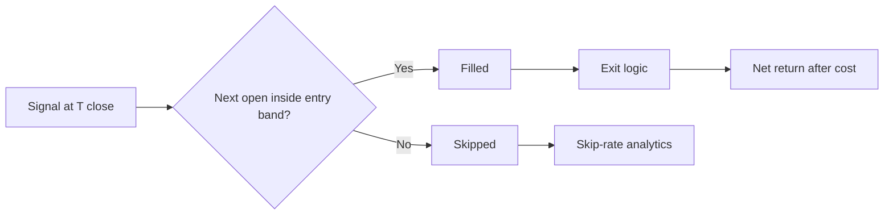

# 한국 주식 자동매매 전략 설계 심층 검토

## Executive summary

사용자가 지정한 entity["company","GitHub","code hosting platform"] 저장소 `pplkjh/trading_bot`를 먼저 점검한 결과, 현재 공개 스냅샷의 **실행 코드 기준**으로는 사용자가 설명한 Strategy A/B가 아직 구현돼 있다고 보기 어렵습니다. `daily_buy_list`와 수집 파이프라인은 일봉 OHLCV, 이동평균, 전일대비, 거래량 평균 정도까지는 계산·저장하지만, Strategy A/B의 핵심인 RSI, Bollinger Bands, MACD histogram, ADX, ATR, 캔들 패턴은 저장 구조와 스코어링 로직에서 확인되지 않았습니다. 또한 문서 파일에는 sim=6과 실시간 조건매수 확장안이 남아 있지만, 현재 `simulator_func_mysql.py` 스냅샷과 설명 문서가 완전히 일치하지는 않습니다. fileciteturn25file0L1-L1 fileciteturn39file0L1-L1 fileciteturn28file0L1-L1 fileciteturn46file0L1-L1

가장 큰 구조적 약점은 **백테스트와 실전 집행의 불일치**입니다. 현재 일별 시뮬레이션은 다음날 시가 체결을 기본 가정으로 두지만, 실전 경로는 현재가가 전일 종가 대비 허용 범위 안에 있을 때만 주문하고, 주문 자체는 시장가로 전송합니다. 더구나 실전 코드에는 “왜 스킵되었는지”를 남기는 신호 로그가 보이지 않습니다. 한국 주식 시장에서는 개장 전 주문이 08:30~09:00 단일가 경매로 모이고, VI가 발동하면 2분 단일가로 전환·연장될 수 있으므로, 이 차이는 돌파형 전략에서 특히 성과를 크게 왜곡할 수 있습니다. fileciteturn29file0L1-L1 fileciteturn28file0L1-L1 citeturn10view0turn9view0turn15view0turn12search5

전략 아이디어만 놓고 보면, 한국 개별주 장기 표본에서는 **종목 단위 모멘텀보다 반전 성향이 더 강했다**는 최근 연구가 있고, 코스닥에서는 **overnight 양(+) 수익과 daytime 음(-) 수익의 반전**, 그리고 개인투자자 관심이 강한 종목일수록 그 반전이 커진다는 증거가 있습니다. 따라서 Strategy A는 “설계 의도는 맞지만 EOD→익일 시가” 조합에서는 실행 리스크가 매우 높고, Strategy B는 한국 시장 미시구조와 더 잘 맞을 가능성이 있지만 **고 IVOL·고 관심 소형주를 강하게 배제할 때만** 실전성이 올라갑니다. citeturn3search3turn3search4turn8search2turn8search6turn4search0turn5search2

사용자가 제시한 sim=3의 누적수익률 +5,547%는 2023-01부터 2026-04까지 약 3.32년으로 환산하면 대략 **연환산 237% 수준**입니다. 이는 실전 기대수익이라기보다 “paper alpha의 상한선”으로 보는 편이 타당합니다. repo의 명시적 세금·수수료 가정은 현재 실거래보다 약간 보수적일 수 있지만, 누락된 항목들—개장 단일가 시장가 슬리피지, 갭 스킵, VI, 경고/위험 종목 노출, 생존편향 가능성—이 훨씬 큰 왜곡 원인입니다. citeturn13calculator0 fileciteturn28file0L1-L1 fileciteturn29file0L1-L1 citeturn12search2turn12search4turn12search5turn6search4turn6search1turn6search0

핵심 결론은 하나입니다. **점수식을 더 복잡하게 만드는 것보다 먼저 집행 일치성을 복원해야 합니다.** 우선순위는 A/B feature store 구축, 신호→익일시가 gap/skip 로깅, purged walk-forward, 유동성·위험 컷오프, 그리고 sim=6의 raw max 방식 대신 슬리브 분리와 점수 정규화입니다. fileciteturn44file0L1-L1 fileciteturn29file0L1-L1 citeturn16search2turn16search14

## 연구 정보 요구사항

이번 검토에서 먼저 알아야 했던 정보 요구사항은 다섯 가지였습니다.

1. **실행 코드가 실제로 무엇을 하는지** — 문서가 아니라 `daily_buy_list`, `collector`, `simulator`, `open_api` 기준으로 매수·매도·세금·스킵 로직을 확인해야 했습니다. fileciteturn25file0L1-L1 fileciteturn39file0L1-L1 fileciteturn28file0L1-L1 fileciteturn29file0L1-L1

2. **시뮬레이터 가정과 실전 경로의 차이** — 익일 시가 집행, 개장 단일가, 시장가 주문, 가격밴드 기반 스킵 여부가 실전성과에 미치는 영향을 분리해야 했습니다. fileciteturn28file0L1-L1 fileciteturn29file0L1-L1 citeturn10view0turn9view0turn15view0turn12search5

3. **사용자 설계한 A/B 규칙과 repo 구현의 차이** — 현재 저장소에 필요한 feature가 있는지, sim 번호가 실제로 연결되는지, 매도 규칙이 동일한지 확인해야 했습니다. fileciteturn28file0L1-L1 fileciteturn46file0L1-L1

4. **한국 시장 미시구조가 전략에 주는 실행 리스크** — 개장 단일가, VI, tick size, 가격제한폭, 시장가 주문 가능 여부를 확인해야 했습니다. citeturn10view0turn9view0turn15view0turn1search0turn1search3

5. **한국 주식의 momentum/reversal/overnight/cost 문헌이 어떤 방향을 가리키는지** — A의 “돌파 초입”과 B의 “과매도 반등” 중 무엇이 더 한국 시장 특성과 맞는지 판단해야 했습니다. citeturn3search3turn3search4turn3search1turn8search2turn4search0turn5search2turn6search4turn6search0

이 순서는 사용자 요청대로 **repo 코드 → 공식 시장 규정 → 한국 학술문헌 → 거래비용 문헌** 순으로 진행했습니다. fileciteturn33file0L1-L1 citeturn10view0turn9view0turn3search3turn6search4

## 레포 점검 결과

이 프로젝트는 entity["company","키움증권","broker seoul south korea"] OpenAPI 기반 자동매매, 수집기, 시뮬레이터를 한 저장소에서 운영하고 있고, `collector`가 `daily_craw`와 `daily_buy_list`를 갱신한 뒤 `realtime_daily_buy_list`를 만드는 구조입니다. README는 시뮬레이터가 실거래와 동일한 주문 로직을 사용한다고 설명하지만, 실제 코드 레벨에서는 entry gate와 execution path가 완전히 동일하지 않습니다. fileciteturn33file0L1-L1 fileciteturn39file0L1-L1 fileciteturn28file0L1-L1 fileciteturn29file0L1-L1

### 핵심 파일과 역할

| 파일 | 역할 | 핵심 함수·변수 | 이번 검토에서 중요한 의미 |
|---|---|---|---|
| `README.md` | 전체 구조 설명 | GUI, OpenAPI, collector, daily_buy_list, simulator | 저장소의 공식 아키텍처 설명이지만, 실행 세부는 코드 확인이 필요했습니다. fileciteturn33file0L1-L1 |
| `library/collector_api.py` | 종목 유니버스·일/분봉·실전 매수리스트 갱신 | `get_code_list`, `daily_buy_list_check`, `realtime_daily_buy_list_check` | `stock_item_all`이 현재 코드리스트에서 구성되고, 그 기반으로 `daily_buy_list`와 내일 매수리스트가 만들어집니다. fileciteturn39file0L1-L1 |
| `library/daily_buy_list.py` | 날짜별 테이블 생성 | `date_rows`, `stock_item_all`, 날짜 테이블 생성 루프 | 저장되는 feature는 OHLCV, 이동평균, 거래량 평균 중심이며 A/B에 필요한 오실레이터 계열은 없습니다. fileciteturn25file0L1-L1 |
| `library/simulator_func_mysql.py` | 백테스트 핵심 엔진 | `variable_setting`, `db_to_realtime_daily_buy_list`, `auto_trade_stock_realtime`, `invest_send_order` | sim 번호별 매수 규칙, 매도 규칙, 세금·수수료, 익일 시가 체결이 이 파일에 집중됩니다. fileciteturn28file0L1-L1 |
| `library/open_api.py` | 실전 주문·스킵 로직 | `get_today_buy_list`, `trade`, 가격밴드 체크, 시장가 주문 | 실전은 가격밴드 조건을 확인한 뒤 시장가 주문을 보내며, 스킵 이유 로그는 별도로 남기지 않는 구조로 보입니다. fileciteturn29file0L1-L1 |
| `info/매수리스트 쿼리 작성 방법.txt` | risk filter 예시 | 관리·불성실·투자주의/경고/위험 제외, `close < invest_unit` | sim4/5류의 보수적 필터는 존재하지만 sim3 및 사용자 A/B 설계와는 직접 연결돼 있지 않습니다. fileciteturn43file0L1-L1 |
| `info/급등주 알고리즘(실습 중 해결 되지 않을 때만 볼 것!).txt` | 구형 돌파형 알고리즘 문서 | 거래대금, `vol20*3 < volume`, `d1_diff_rate > 2` | 현재 사용자가 구상한 A와 유사한 “전구축 흔적”은 있으나, RSI/BB/MACD/ADX 구조는 없습니다. fileciteturn32file0L1-L1 |
| `info/모멘텀전략.txt` / `info/실시간 주가 분석 알고리즘 예제.txt` | 설계 문서·주석 코드 | sim6, 절대·상대모멘텀, `trade_check_num` 설명 | 문서상 설계와 실행 코드 스냅샷 사이에 드리프트가 있어 “문서상 존재”와 “실행 중 존재”를 구분해야 합니다. fileciteturn30file0L1-L1 fileciteturn46file0L1-L1 |
| `info/bot 데이터베이스 종류v2.txt` | DB 스키마 설명 | `all_item_db`, `jango_data`, `realtime_daily_buy_list` | 어떤 테이블이 어떤 역할을 하는지, 무엇을 새로 로깅해야 하는지 판단하는 기준을 제공합니다. fileciteturn44file0L1-L1 |

### 구현과 미구현의 경계

아래 표는 “사용자 설계”와 “현재 repo 실행 코드” 사이의 차이를 핵심만 뽑아 정리한 것입니다.

| 항목 | 사용자 설계 | repo 스냅샷에서 확인된 상태 | 판단 |
|---|---|---|---|
| A/B feature 세트 | RSI, BB, MACD hist, ADX, ATR, 캔들 패턴 필수 | 저장·갱신되는 기본 feature는 OHLCV, MA, vol 평균 중심 | **미구현**. A/B를 검증하려면 별도 feature table 또는 컬럼 추가가 필요합니다. fileciteturn25file0L1-L1 fileciteturn39file0L1-L1 |
| sim4/5/6 매수 규칙 | A/B 및 혼합 | 현재 실행 코드의 sim4/5는 구형 전략이며, sim6은 문서와 코드가 어긋나 보이고 사용자 설명의 A+B 혼합을 실행 코드에서 바로 확인하기 어렵습니다. | **문서-코드 드리프트**. sim 번호를 믿기보다 실제 분기문을 다시 맞춰야 합니다. fileciteturn28file0L1-L1 fileciteturn46file0L1-L1 |
| 공통 매도 조건 | sim3/4/5/6 모두 +6% / -3% / MA5<MA20 | 현재 코드 스냅샷 기준 sim3는 `sell_list_num=2` 성격이고, sim4/5/6은 동일 exit로 정렬되어 있지 않습니다. 기본값도 +10/-2 계열입니다. | **직접 비교 불가**. 비교 백테스트 전에 exit 로직부터 통일해야 합니다. fileciteturn28file0L1-L1 |
| 익일 시가 집행 vs 실전 스킵 | backtest와 live가 같아야 함 | 일별 시뮬레이션은 시가 체결을 가정하지만 live는 가격밴드 확인 후 시장가 주문이며, 가격 조건 미달이면 스킵됩니다. | **가장 큰 왜곡 요인**입니다. 특히 A전략에서 치명적입니다. fileciteturn28file0L1-L1 fileciteturn29file0L1-L1 |
| 스킵 사유 로그 | 필요 | `check_item` 갱신은 보이나 “왜 안 샀는지”를 누적 저장하는 구조는 보이지 않음 | **미비**. skip rate를 측정할 수 없으면 실전화 판단이 어렵습니다. fileciteturn29file0L1-L1 fileciteturn44file0L1-L1 |
| 생존편향 방지 | 과거 상폐 포함 여부 확인 필요 | `stock_item_all`이 현재 코드리스트 기반으로 재구성되고, `daily_buy_list`도 그 유니버스를 순회합니다. | 과거 상폐 종목이 완전히 보존되는지는 **uncertain**입니다. 과거 테이블을 재생성하면 누락 위험이 있습니다. fileciteturn39file0L1-L1 fileciteturn25file0L1-L1 |
| 데이터 정합성 | 액면분할·증자 반영 필수 | `collector_api`는 수정주가 차이를 감지하면 과거 테이블을 삭제 후 재수집하고 `daily_buy_list`도 업데이트합니다. | **장점**입니다. corporate action 정합성은 일부 방어하고 있습니다. fileciteturn39file0L1-L1 |
| 명시적 비용 | 수수료·세금 현실 반영 | repo는 `tax_rate=0.25%`, `fees_rate=0.015%` 계열을 사용 | 2026 현재 실거래 비용보다는 약간 높은 편이지만, 누락된 슬리피지·시장충격에 비하면 작은 차이입니다. fileciteturn28file0L1-L1 citeturn12search2turn12search4turn12search5 |

repo의 sim3 기본값은 `초기자본 1,000만원`, `invest_unit 300만원`, `limit_money 100만원` 조합이라 코드상 동시 보유 종목 수가 사실상 3개 수준입니다. 이는 사용자 현재 계획인 `1종목 100만원`보다 훨씬 집중도가 높고, 이런 집중형 구조는 CAGR을 키우는 대신 MDD와 분산도 크게 키웁니다. sim3의 +5,547%와 MDD 55%가 같이 나온 점은 이 구조와도 잘 맞습니다. fileciteturn28file0L1-L1

## 시장 미시구조와 전략 평가

entity["organization","한국거래소","seoul south korea"] 규정상 개장 전 주문은 08:30~09:00에 단일가 경매로 모여 한 가격에 체결되고, 시장가 주문도 이 구간에서 허용됩니다. 시장가 주문은 가격 제한이 없기 때문에 반대호가가 얇을 때 체결가격을 급격히 움직일 수 있습니다. 여기에 VI가 걸리면 2분 단일가 냉각 구간이 반복되고, 발동 횟수에도 일중 제한이 없습니다. 즉 “전일 종가에 계산한 좋은 신호”가 “익일 시가 시장가 체결”로 넘어가는 순간, 점수의 의미가 가장 많이 훼손되는 시장 구조입니다. citeturn10view0turn15view0turn9view0

또한 한국 주식의 tick size는 가격대별로 고정이고, 저가주일수록 최소 스프레드 비율이 체감상 커집니다. 그런데 repo와 사용자 제약 모두 `close < invest_unit`을 사실상의 가격 필터로 쓰는 구조라, 이것만으로는 “싸고 스프레드가 큰 종목”을 거의 걸러내지 못합니다. 1백만원 이하 가격 조건은 고가주만 제외할 뿐, 미시유동성 리스크를 통제하지 못합니다. citeturn1search0 fileciteturn43file0L1-L1

### A/B 전략별 실전 신뢰도 평가

| 전략 | 한국시장 적합성 | EOD→익일시가 신뢰도 | 주요 리스크 | 권장 필터 | 종합 판단 |
|---|---|---|---|---|---|
| **Strategy A** 돌파 초입 | “압축 후 돌파 + 거래량” 자체는 이벤트형 롱 전략으로 타당하지만, 한국 개별주 장기 표본에서 종목 단위 momentum은 전반적으로 reversal 성향이 강해 중기 factor로 일반화하기는 어렵습니다. citeturn3search3turn3search4 | **낮음~보통 이하**. 개장 단일가·시장가·VI 구조 때문에 종가 기준 돌파가 익일 시가에서는 이미 과열 상태일 수 있습니다. 코스닥 attention 종목에서는 overnight 양(+) 수익 후 daytime 음(-) 수익 반전도 보고됐습니다. citeturn10view0turn9view0turn8search2turn12search5 | 갭 상승 후 고점 체결, VI 연장, live 스킵 증가, intraday reversal, 거래대금 부족 종목에서의 빈 호가 리스크 | 다음날 **실제 시가 갭 필터**를 백테스트에 반영하고, 20일 평균 거래대금 하드컷, 관리/경고/위험 제외, 가능하면 blind-open 대신 분봉 조건매수(`trade_check_num` 계열)로 전환 | **아이디어는 좋지만 실행형태를 바꾸지 않으면 가장 먼저 무너질 전략**입니다. fileciteturn29file0L1-L1 fileciteturn46file0L1-L1 |
| **Strategy B** 저점 반등 | 한국 시장에는 단기 반전, 코스닥 overnight/daytime reversal, 산업 내 short-term reversal 우위가 문헌상 존재해 A보다 시장 특성에 더 가깝습니다. citeturn3search1turn8search2turn4search5turn4search6 | **보통**. 다만 “과매도”가 단순히 정보 반영 지연이 아니라 고IVOL·고관심·악재 지속 종목이면 반등보다 추가 하락이 더 흔할 수 있습니다. citeturn4search0turn5search2 | falling knife, 악재 지속, 개인 과열 수급, 고 IVOL 이름의 value trap, dead-cat bounce | 단순 RSI 반등이 아니라 **산업 내 상대약세 후 회복**, 20일 평균 거래대금 컷오프, 경고/위험 제외, ATR/IVOL 상한, overnight gap-up 과열 차단 | **한국형 기본 슬리브로는 A보다 우위**지만, “싸게 보이는 소형주 아무거나”를 사면 실패할 가능성이 큽니다. |

Strategy B를 더 높게 보는 이유는 “한국 시장에서는 반전이 있다”는 단순한 말 때문이 아니라, **반전이 특히 attention/IVOL/개인수급과 얽힌 상태에서 강해진다**는 점 때문입니다. 따라서 B를 살리려면 oversold 자체보다 **어떤 oversold를 고를지**가 더 중요합니다. 최근 한국 연구가 “산업 내 단기반전”이 무조건적 단기반전보다 강했다고 보고한 점도, B를 개별 RSI 전략이 아니라 **산업상대 약세 + 개별 반등 확인** 구조로 바꾸라는 신호에 가깝습니다. citeturn4search5turn4search6turn5search2turn4search0

반대로 A는 설계상 `완전 MA 정배열`을 피하고 `초입`만 노리려는 점이 좋습니다. 하지만 문제는 **초입 여부를 t일 종가에서 판단해도, 실제 진입은 t+1 개장 단일가**라는 점입니다. 한국 시장에서 이 overnight 구간은 정보 반영과 수급 쏠림이 가장 강한 구간이므로, A는 점수화보다 먼저 “익일 시가가 얼마나 멀리 가버렸는지”를 봐야 합니다. 이것이 현재 repo와 사용자 설계에서 가장 크게 빠져 있는 검증입니다. citeturn10view0turn8search2turn4search0 fileciteturn29file0L1-L1

## sim=6 운영과 현실 수익 기대

sim=6의 `max(score_A, score_B)` 방식은 직관적이지만, 실전에서는 **두 개의 서로 다른 분포를 가진 점수를 같은 축에서 비교한다**는 문제가 있습니다. 게다가 거래비용 문헌에서는 momentum이 short-term reversal보다 상대적으로 더 구현 가능하고, short-term reversal은 비용에 훨씬 취약하다는 결과가 반복적으로 나옵니다. 한국 개별주 문헌에서도 stock-level momentum은 장기적으로 reversal 편향이 강했습니다. 따라서 A와 B를 raw score로 합쳐 “더 큰 쪽 하나만 채택”하는 방식은 보통 정보 결합이라기보다 **점수 스케일 차이와 노이즈 합산**이 됩니다. citeturn6search0turn6search1turn6search4turn3search3turn3search4

### sim=6 운영 권고

| 권고 항목 | 왜 필요한가 | 구체 권고 |
|---|---|---|
| 점수 정규화 | A와 B는 점수 분포와 hit-rate가 다르므로 raw max는 왜곡됩니다. | 각 전략 내부에서 train fold 기준 percentile 또는 z-score로 정규화한 뒤 비교하십시오. |
| 슬리브 분리 | momentum/event sleeve와 reversal sleeve는 turnover, 비용, 실패 패턴이 다릅니다. | 초기에는 `A standalone`, `B standalone`을 먼저 돌리고, 이후 `A 40~50% / B 50~60% / 현금 0~10%` 식으로 분리 운용하는 편이 낫습니다. |
| 동일 종목 충돌 처리 | “같은 종목에 A와 B가 동시에 뜸”은 보통 regime ambiguity 신호입니다. | raw 점수 큰 쪽을 택하지 말고, 높은 **정규화 점수** 또는 더 낮은 예상 실행비용 쪽으로 배정하십시오. |
| 자본 배분 | A는 체결 리스크가 크고 B는 함정 리스크가 큽니다. | 1백만원 단위라면 초기엔 전략별 최대 보유 수를 따로 캡하고, A의 동시보유 수를 B보다 낮게 두는 편이 안전합니다. |
| 검증 순서 | 혼합 전략을 먼저 튜닝하면 원인 분리가 불가능합니다. | **B 단독 → A 단독 → 공통 exit 통일 → cost-aware → sleeve mix** 순서가 가장 효율적입니다. |

이 권고는 entity["company","AQR Capital Management","systematic investor us"] 의 거래비용 연구가 **momentum은 비용 최적화의 혜택을 받기 쉽고 short-term reversals는 그렇지 않다**고 본 점, 그리고 한국 시장에서 **개별주 momentum이 구조적으로 강하지 않다**는 최근 실증을 함께 반영한 것입니다. citeturn6search0turn6search2turn3search3turn3search4

### 현실적 기대수익 시나리오

아래 수치는 **실측 추정치가 아니라 시나리오 분석**입니다. 현재 repo에는 신호→체결→스킵 로그가 없고, 사용자의 실제 DB에 상폐 종목이 어떻게 보존돼 있는지도 확인하지 못했으므로 일부는 **uncertain**합니다. 다만 repo 구조, 한국 시장 미시구조, 거래비용 문헌을 반영하면 이 정도 범위를 먼저 가정하는 것이 방어적입니다. fileciteturn29file0L1-L1 fileciteturn39file0L1-L1 citeturn10view0turn9view0turn6search4turn6search0

| 케이스 | 핵심 가정 | 현실적 기대 CAGR | 예상 MDD | 해석 |
|---|---|---:|---:|---|
| 낙관 | A/B 구현 완료, signal log 있음, 20일 평균 거래대금 하드컷, 경고/위험 제외, 익일 갭 필터 반영, 생존편향 미미 | **25~50%** | **30~45%** | 아주 잘 맞는 regime과 엄격한 필터가 동시에 필요합니다. |
| 기준 | 일부 regime decay, 평균적인 opening-gap 불리함, skip 15~30%, 슬리피지 반영, 데이터 편향 소폭 존재 | **5~20%** | **40~60%** | 제가 가장 먼저 underwriting할 범위는 이쪽입니다. |
| 비관 | A가 고attention 돌파주에 치우치고, B가 high-IVOL 소형주 함정에 많이 걸리며, skip/log 부재와 생존편향이 큼 | **-15~5%** | **55~75%** | 백테스트는 좋아 보여도 실전에서 가장 흔한 실패 시나리오입니다. |

중요한 점은 repo의 명시적 세금·수수료가 현재 실거래보다 약간 높더라도, 그 차이는 대략 수 bp~수십 bp 수준입니다. 반면 opening-auction 시장가 체결, VI, 장전 갭, event name에서의 빈 호가 슬리피지는 한 번에 그보다 훨씬 큰 비용을 만들 수 있습니다. 그래서 실전 보정에서 정말 중요한 것은 “세율 5bp 차이”가 아니라 **체결 구조와 스킵 구조를 백테스트에 이식했는지**입니다. fileciteturn28file0L1-L1 citeturn12search2turn12search4turn12search5turn10view0turn9view0

## 우선 실험과 코드 예시

현재 단계에서 가장 가치가 큰 실험은 **더 많은 지표 추가**가 아니라 **신호가 실제로 어떻게 체결되는지 계기화하는 것**입니다. repo 스키마에는 `daily_craw`, `daily_buy_list`, `realtime_daily_buy_list`, `all_item_db`, `jango_data`가 이미 잡혀 있으므로, 여기에 `signal_log`만 추가해도 가장 중요한 실전/백테스트 괴리를 수치화할 수 있습니다. fileciteturn44file0L1-L1 fileciteturn39file0L1-L1

### 우선 검증 순서

| 우선순위 | 실험 | 왜 먼저 해야 하는가 | 합격 기준 예시 |
|---|---|---|---|
| 첫째 | signal→익일시가 gap/skip 측정 | A전략의 체결 가능성부터 확인해야 하기 때문 | A의 price-band skip이 20% 이하, 평균 불리한 gap이 허용 범위 이내 |
| 둘째 | 공통 exit 통일 후 A/B 단독 백테스트 | 현재 repo snapshot상 exit가 섞여 있습니다. | A/B가 같은 cost·exit 조건에서 비교 가능 |
| 셋째 | purged walk-forward | overlapping label과 regime leakage를 줄여야 합니다. | fold 간 성과 분산이 허용 가능 수준 |
| 넷째 | 유동성·위험 컷오프 sweep | 한국 소형주 전략은 필터가 성과를 좌우합니다. | 기대수익 감소보다 MDD와 tail risk 감소가 더 큼 |
| 다섯째 | sim=6 normalized sleeve mix | 단독 전략이 검증된 뒤에만 혼합이 의미가 있습니다. | 단독 최고 전략보다 mix의 Sharpe/MDD가 개선 |

purged walk-forward를 권하는 이유는 한국 주식 전략처럼 보유기간이 겹치고 labels가 overlapping되는 경우, 일반 walk-forward나 단순 시계열 split가 성과를 낙관적으로 만들 수 있기 때문입니다. purge와 embargo를 써야 “훈련 구간이 테스트 구간의 미래를 은근히 본 상태”를 줄일 수 있습니다. citeturn16search2turn16search14



이 흐름도는 지금 전략 검증에서 핵심이 “점수”가 아니라 “점수 이후 실제 체결 경로”라는 점을 보여 줍니다. 특히 A는 `C`가, B는 `F`의 tail-loss가 핵심입니다. fileciteturn29file0L1-L1 citeturn10view0turn9view0

### 코드 예시

아래는 **신규 로그 테이블 예시**입니다. 현재 repo 스키마를 보완해 신호와 체결 사이를 분리 기록하는 용도입니다.

```sql
CREATE TABLE signal_log (
    signal_date      CHAR(8)      NOT NULL,
    entry_date       CHAR(8)      NOT NULL,
    code             CHAR(6)      NOT NULL,
    code_name        VARCHAR(64)  NOT NULL,
    strategy_tag     CHAR(1)      NOT NULL,   -- 'A' or 'B'
    score_raw        DECIMAL(8,2) NOT NULL,
    score_norm       DECIMAL(8,4) NULL,
    y_close          INT          NOT NULL,
    next_open        INT          NULL,
    gap_pct          DECIMAL(8,4) NULL,
    vol20            BIGINT       NULL,
    atr_pct          DECIMAL(8,4) NULL,
    skipped_price_band TINYINT(1) DEFAULT 0,
    skipped_liquidity  TINYINT(1) DEFAULT 0,
    filled           TINYINT(1)   DEFAULT 0,
    fill_price       INT          NULL,
    exit_price       INT          NULL,
    rtn_after_cost   DECIMAL(8,4) NULL,
    PRIMARY KEY (signal_date, code, strategy_tag)
);
```

이런 로그가 있으면 A/B별로 “좋은 신호가 많다”가 아니라 “실제로 체결 가능한 좋은 신호가 많다”를 볼 수 있습니다. 현재 repo의 `all_item_db`와 `realtime_daily_buy_list`만으로는 이 중간단계가 비어 있습니다. fileciteturn44file0L1-L1 fileciteturn29file0L1-L1

다음 쿼리는 전략별 익일 갭과 스킵률을 바로 보는 최소 집계 예시입니다.

```sql
SELECT
    strategy_tag,
    COUNT(*) AS n_signals,
    ROUND(AVG(gap_pct), 3) AS avg_gap_pct,
    ROUND(AVG(CASE WHEN skipped_price_band = 1 THEN 1 ELSE 0 END) * 100, 2) AS skip_price_band_pct,
    ROUND(AVG(CASE WHEN filled = 1 THEN rtn_after_cost END), 3) AS avg_filled_return
FROM signal_log
GROUP BY strategy_tag;
```

이 지표를 먼저 봐야 Strategy A가 “수익성이 낮은 전략”인지, 아니면 “좋은 신호를 내지만 거의 체결이 안 되는 전략”인지 구분할 수 있습니다. 이 둘은 개선 방법이 완전히 다릅니다. fileciteturn29file0L1-L1 citeturn10view0turn12search5

생존편향 감사를 위한 최소 쿼리도 필요합니다. repo 구조상 현재 유니버스 테이블과 과거 일봉 테이블의 불일치를 바로 점검할 수 있습니다.

```sql
SELECT
    dc.table_name AS daily_craw_table_not_in_current_universe
FROM information_schema.tables dc
LEFT JOIN daily_buy_list.stock_item_all s
       ON dc.table_name = s.code_name
WHERE dc.table_schema = 'daily_craw'
  AND s.code IS NULL
ORDER BY dc.table_name;
```

이 결과가 많이 나오면 “현재 유니버스로 historical table을 다시 짜는 순간 상폐·이관 종목이 탈락할 수 있다”는 뜻입니다. 상폐 포함 여부는 repo만으로 단정할 수 없어 **uncertain**이지만, 이 쿼리로 최소한 위험 징후를 확인할 수 있습니다. fileciteturn39file0L1-L1 fileciteturn25file0L1-L1

다음은 purged walk-forward의 최소한의 파이썬 뼈대입니다. 핵심은 **train 안에서만 threshold와 점수 정규화를 확정**하고, test는 순수 out-of-sample로 두는 것입니다.

```python
from dataclasses import dataclass
from typing import Iterator, Tuple
import pandas as pd

@dataclass
class Fold:
    train_start: pd.Timestamp
    train_end: pd.Timestamp
    test_start: pd.Timestamp
    test_end: pd.Timestamp

def purged_walk_forward(
    dates: pd.DatetimeIndex,
    train_days: int = 252,
    test_days: int = 63,
    embargo_days: int = 5,
) -> Iterator[Fold]:
    i = train_days
    while i + embargo_days + test_days <= len(dates):
        train_start = dates[0]
        train_end = dates[i - 1]
        test_start = dates[i + embargo_days]
        test_end = dates[i + embargo_days + test_days - 1]
        yield Fold(train_start, train_end, test_start, test_end)
        i += test_days

def normalize_within_train(train_df: pd.DataFrame, test_df: pd.DataFrame, score_col: str) -> Tuple[pd.DataFrame, pd.DataFrame]:
    mu = train_df[score_col].mean()
    sigma = train_df[score_col].std(ddof=0)
    sigma = sigma if sigma > 0 else 1.0
    train_df = train_df.copy()
    test_df = test_df.copy()
    train_df["score_norm"] = (train_df[score_col] - mu) / sigma
    test_df["score_norm"] = (test_df[score_col] - mu) / sigma
    return train_df, test_df
```

이 구조에서 A와 B를 따로 정규화한 뒤, test 구간에서만 슬리브 배분을 비교하면 sim=6의 “raw max 왜곡”을 많이 줄일 수 있습니다. citeturn16search2turn16search14

마지막으로, blind open을 바로 버리기 어렵다면 저장소에 남아 있는 `trade_check_num` 계열 아이디어를 적극 활용하는 편이 낫습니다. 특히 A전략은 “전일 종가 신호”를 유지하되, 익일에는 가격이 전일 종가 대비 허용 범위 안에 들어올 때만 진입하는 구조가 필요합니다.

```python
# 개념 예시: A 전략의 실전형 진입 조건
self.use_min = True
self.only_nine_buy = False
self.trade_check_num = 2   # 가격 밴드 체크
self.invest_limit_rate = 1.008   # 전일 종가 대비 +0.8% 초과면 추격 금지
self.invest_min_limit_rate = 0.992  # 전일 종가 대비 -0.8% 하회면 패스
```

문서상 이 구조는 이미 저장소에 소개돼 있습니다. 즉, 지금 필요한 것은 completely new engine이라기보다 **현재 엔진에 A/B feature와 gap-aware logging을 붙이는 작업**에 가깝습니다. fileciteturn46file0L1-L1

결론적으로, 현재 설계의 가장 큰 병목은 “A가 더 좋으냐 B가 더 좋으냐”보다 **익일 시가 시장가 집행을 어떻게 백테스트와 일치시킬 것이냐**입니다. 한국 시장에서는 그 차이가 점수 10점, 20점보다 훨씬 큽니다. 그러므로 다음 실험은 반드시 **A/B feature 구현 → signal log → skip/gap 측정 → 공통 exit 재비교 → cost-aware walk-forward → sim=6 슬리브화** 순서로 진행하는 것이 맞습니다. fileciteturn29file0L1-L1 citeturn10view0turn9view0turn6search4turn16search2